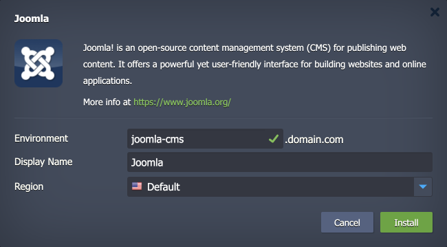

 

# Joomla

The package deploys the Joomla CMS solution - an open-source and user-friendly content management system for building websites and powerful online applications.

## Environment Topology

This package creates a dedicated Joomla environment which contains one application server and one database container, deploys and setups the Joomla application. Additionally, automatic vertical (per container) and horizontal scaling (for both layers) are configured out-of-the-box. The default software stacks utilized in the package are the following:

- Apache 2 PHP application server (PHP 8.3)
- MySQL 8 database
- Joomla 5.1.4

## Deployment to Cloud

To get your Joomla solution, click the "**Deploy to Cloud**" button below, specify your email address within the widget, choose one of the [Virtuozzo Public Cloud Providers](https://www.virtuozzo.com/application-platform-partners/), and confirm by clicking **Install**.

> If you already have a Virtuozzo Application Platform (VAP) account, you can deploy this solution from the [Marketplace](https://www.virtuozzo.com/application-platform-docs/marketplace/) or [import](https://www.virtuozzo.com/application-platform-docs/environment-import/) a manifest file from this repository.

## Installation Process

In the opened installation window at the VAP dashboard, provide a preferred environment and display names, choose a region (if available), and confirm the installation.

Your Joomla application will be automatically installed in a few minutes.
